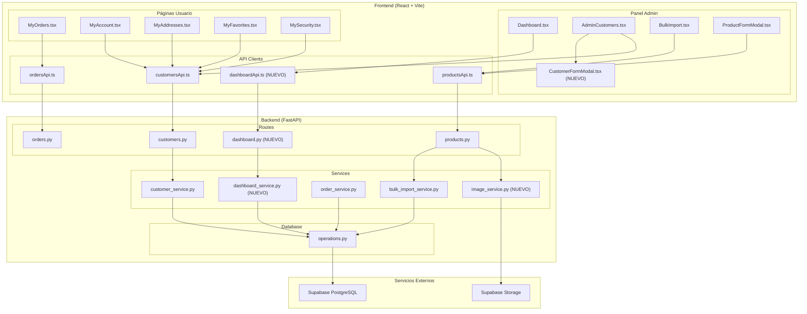
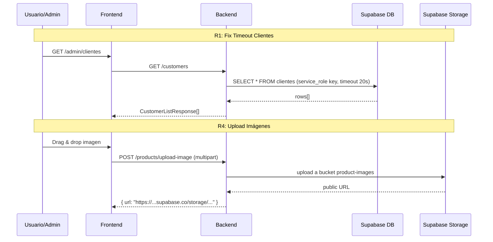

# Documento de Diseño — Sprint 2: Completar E-commerce SantyHogar

## Visión General

Este diseño cubre las 8 áreas funcionales del Sprint 2 para llevar SantyHogar a un MVP funcional end-to-end. El sprint resuelve problemas de infraestructura (timeout de clientes, RLS), completa funcionalidades admin (modal de clientes, importación Excel, upload de imágenes, dashboard real) y conecta las páginas de usuario al backend (pedidos, cuenta, direcciones, favoritos, seguridad).

**Stack existente:**
- **Backend:** FastAPI + Supabase (PostgreSQL) + Mercado Pago
- **Frontend:** React 18 + TypeScript + Vite + Tailwind CSS
- **Dependencias clave ya instaladas:** `openpyxl`, `exceljs`, `hypothesis`

**Principio de diseño:** Cada cambio se integra con la arquitectura existente (DatabaseOperations → Service → Route → API client → Componente React). No se introducen nuevas librerías ni patrones; se extiende lo que ya funciona.

---

## Arquitectura

### Diagrama de Componentes



### Flujo de Datos por Requerimiento



---

## Componentes e Interfaces

### 1. Backend — Nuevos Endpoints y Servicios

#### 1.1 Fix Timeout Clientes (R1)

**Cambios en `operations.py`:**
- El método `get_all_customers` ya tiene `asyncio.wait_for` con timeout de 20s — esto está correcto.
- **Acción:** Verificar que la conexión usa `service_role` key (no `anon` key) para evitar bloqueos RLS. Revisar `connection.py` y la variable `SUPABASE_KEY`.
- **Acción:** Si hay políticas RLS en la tabla `clientes`, deshabilitarlas para la service_role key o agregar una política `USING (true)` para el rol de servicio.

#### 1.2 Upload de Imágenes (R4)

**Nuevo servicio: `image_service.py`**

```python
class ImageService:
    BUCKET = "product-images"
    MAX_SIZE = 5 * 1024 * 1024  # 5 MB
    ALLOWED_TYPES = {"image/jpeg", "image/png", "image/webp"}

    async def upload_image(self, file: UploadFile) -> str:
        """Sube imagen a Supabase Storage y retorna URL pública."""
        # Validar tipo y tamaño
        # Generar nombre único con UUID
        # Subir a bucket product-images
        # Retornar URL pública
```

**Nuevo endpoint en `products.py`:**
```
POST /products/upload-image → { url: string }
```

#### 1.3 Parser Excel (R3)

**Reescritura de `bulk_import_service.py`:**

```python
def parse_xlsx_file(file_content: bytes) -> List[ProductImportValidation]:
    """Parsea .xlsx con openpyxl. Detecta columnas por nombre de header."""
    wb = load_workbook(BytesIO(file_content), read_only=True)
    ws = wb.active
    # Leer primera fila como headers
    # Mapear columnas: nombre, precio, stock, categoría, marca, descripción
    # Iterar filas y validar
```

**Cambios en endpoint:**
- Aceptar `.xlsx` en lugar de `.doc/.docx`
- Separar parseo (preview) de importación (confirm)
- Nuevo endpoint: `POST /products/bulk-import/preview` → retorna validaciones sin insertar
- Endpoint existente `POST /products/bulk-import` → recibe lista de productos validados y los inserta

#### 1.4 CustomerFormModal (R2)

**Nuevo componente: `CustomerFormModal.tsx`**

```typescript
interface Props {
  customer: CustomerDetail | null;  // null = modo creación
  mode: 'create' | 'edit' | 'view';
  onSave: () => void;
  onClose: () => void;
}
```

Campos: nombre, email, teléfono, dirección, ciudad, provincia, código postal, notas.
En modo "view": muestra historial de pedidos del cliente (GET `/customers/{id}/orders`).

#### 1.5 Dashboard Endpoints (R5)

**Nuevo archivo: `backend/app/routes/dashboard.py`**

| Endpoint | Respuesta |
|---|---|
| `GET /dashboard/stats` | `{ salesDay, salesWeek, salesMonth, orderCount, avgTicket, activeProducts, lowStockProducts, newCustomersMonth }` |
| `GET /dashboard/sales-chart` | `[{ date, total }]` — últimos 7 días |
| `GET /dashboard/top-products` | `[{ name, quantitySold, totalRevenue }]` — top 5 |
| `GET /dashboard/top-customers` | `[{ name, email, totalSpent, orderCount }]` — top 5 |

**Nuevo servicio: `dashboard_service.py`**

Consultas SQL vía PostgREST:
- `stats`: Agrega sobre tablas `ordenes`, `productos`, `clientes` con filtros de fecha.
- `sales-chart`: Agrupa `ordenes` por fecha de los últimos 7 días.
- `top-products`: JOIN `items_orden` + `productos`, agrupa por producto, ordena por cantidad.
- `top-customers`: Ordena `clientes` por `total_gastado` DESC, LIMIT 5.

#### 1.6 Órdenes por Email (R6)

**Cambio en `orders.py`:**
```python
@router.get("/orders")
async def list_orders(email: Optional[str] = Query(None)):
    # Si email está presente, filtrar por email_cliente
    # Si no, retornar todas (admin)
```

**Cambio en `operations.py`:**
```python
async def get_orders_by_email(self, email: str) -> List[dict]:
    # SELECT * FROM ordenes WHERE email_cliente = email ORDER BY fecha_creacion DESC
```

#### 1.7 PATCH Customer (R7)

El endpoint `PATCH /customers/{id}` ya existe y funciona. Solo falta conectar el frontend.

#### 1.8 Endpoints de Usuario (R8)

**Nuevas tablas (migración 006):**

```sql
CREATE TABLE IF NOT EXISTS public.direcciones (
    id_direccion UUID PRIMARY KEY DEFAULT gen_random_uuid(),
    id_cliente UUID NOT NULL REFERENCES clientes(id_cliente) ON DELETE CASCADE,
    etiqueta VARCHAR(50) NOT NULL,
    calle TEXT NOT NULL,
    ciudad VARCHAR(100) NOT NULL,
    provincia VARCHAR(100) NOT NULL,
    codigo_postal VARCHAR(20) NOT NULL,
    es_principal BOOLEAN DEFAULT FALSE,
    fecha_creacion TIMESTAMP WITH TIME ZONE DEFAULT NOW()
);

CREATE TABLE IF NOT EXISTS public.favoritos (
    id_cliente UUID NOT NULL REFERENCES clientes(id_cliente) ON DELETE CASCADE,
    id_producto UUID NOT NULL REFERENCES productos(id_producto) ON DELETE CASCADE,
    fecha_creacion TIMESTAMP WITH TIME ZONE DEFAULT NOW(),
    PRIMARY KEY (id_cliente, id_producto)
);
```

**Nuevos endpoints:**

| Recurso | Método | Ruta |
|---|---|---|
| Direcciones | GET | `/customers/{id}/addresses` |
| Direcciones | POST | `/customers/{id}/addresses` |
| Direcciones | PATCH | `/customers/{id}/addresses/{addressId}` |
| Direcciones | DELETE | `/customers/{id}/addresses/{addressId}` |
| Favoritos | GET | `/customers/{id}/favorites` |
| Favoritos | POST | `/customers/{id}/favorites` |
| Favoritos | DELETE | `/customers/{id}/favorites/{productId}` |
| Seguridad | POST | `/auth/change-password` |

---

## Modelos de Datos

### Schemas Nuevos (Pydantic)

```python
# Dashboard
class DashboardStats(BaseModel):
    sales_day: float
    sales_week: float
    sales_month: float
    order_count: int
    avg_ticket: float
    active_products: int
    low_stock_products: int
    new_customers_month: int

class SalesChartPoint(BaseModel):
    date: str
    total: float

class TopProduct(BaseModel):
    name: str
    quantity_sold: int
    total_revenue: float

class TopCustomer(BaseModel):
    name: str
    email: str
    total_spent: float
    order_count: int

# Direcciones
class AddressResponse(BaseModel):
    id: UUID
    label: str
    street: str
    city: str
    province: str
    zip: str
    isPrimary: bool

class CreateAddressRequest(BaseModel):
    label: str
    street: str
    city: str
    province: str
    zip: str
    isPrimary: bool = False

class UpdateAddressRequest(BaseModel):
    label: Optional[str] = None
    street: Optional[str] = None
    city: Optional[str] = None
    province: Optional[str] = None
    zip: Optional[str] = None
    isPrimary: Optional[bool] = None

# Favoritos
class FavoriteRequest(BaseModel):
    productId: UUID

class FavoriteResponse(BaseModel):
    productId: UUID
    addedAt: str

# Importación Excel
class ExcelImportPreview(BaseModel):
    total_rows: int
    valid_rows: int
    invalid_rows: int
    validations: List[ProductImportValidation]

class ExcelImportConfirm(BaseModel):
    rows: List[int]  # índices de filas a importar

# Upload de imagen
class ImageUploadResponse(BaseModel):
    url: str
    filename: str
```

### Tabla `productos` — Campos Existentes

| Campo BD | Tipo | Mapeo API |
|---|---|---|
| id_producto | UUID | id |
| nombre | VARCHAR | name |
| slug | VARCHAR | slug |
| categoria | VARCHAR | category |
| subcategoria | VARCHAR | subcategory |
| precio | DECIMAL | price |
| precio_original | DECIMAL | originalPrice |
| stock | INT | stock |
| marca | VARCHAR | brand |
| descripcion | TEXT | description |
| imagenes | JSONB | images[] |
| especificaciones | JSONB | specs |
| destacado | BOOLEAN | featured |
| calificacion | DECIMAL | rating |
| cantidad_resenas | INT | reviews |

### Tabla `clientes` — Campos Existentes

| Campo BD | Tipo | Mapeo API |
|---|---|---|
| id_cliente | UUID | id |
| nombre | VARCHAR | name |
| email | VARCHAR | email |
| telefono | VARCHAR | phone |
| direccion | TEXT | address |
| ciudad | VARCHAR | city |
| provincia | VARCHAR | province |
| codigo_postal | VARCHAR | postalCode |
| total_gastado | DECIMAL | totalSpent |
| cantidad_ordenes | INT | orderCount |
| notas | TEXT | notes |
| activo | BOOLEAN | active |

---

## Propiedades de Correctitud

*Una propiedad es una característica o comportamiento que debe cumplirse en todas las ejecuciones válidas de un sistema — esencialmente, una declaración formal sobre lo que el sistema debe hacer. Las propiedades sirven como puente entre especificaciones legibles por humanos y garantías de correctitud verificables por máquinas.*

### Propiedad 1: Round-trip de parseo Excel

*Para cualquier* conjunto válido de datos de productos (nombre, categoría, subcategoría, precio, stock, marca), escribir esos datos en un archivo `.xlsx` y luego parsearlos con el `parse_xlsx_file` debe producir un conjunto de productos equivalente al original.

**Valida: Requerimientos 3.1, 3.2, 3.9**

### Propiedad 2: Detección automática de columnas Excel

*Para cualquier* permutación de columnas reconocidas (nombre, precio, stock, categoría, marca, descripción) en la primera fila de un `.xlsx`, el parser debe mapear correctamente cada columna a su campo correspondiente, independientemente del orden.

**Valida: Requerimiento 3.3**

### Propiedad 3: Validación de filas con campos obligatorios vacíos

*Para cualquier* fila de un archivo `.xlsx` donde el campo `nombre` esté vacío o ausente, el parser debe marcar esa fila como inválida con un mensaje de error descriptivo, y la fila no debe aparecer en el conjunto de productos válidos.

**Valida: Requerimiento 3.4**

### Propiedad 4: Unicidad de email en creación de clientes

*Para cualquier* email que ya exista en la tabla `clientes`, intentar crear un nuevo cliente con ese mismo email debe resultar en un error que contenga "Ya existe un cliente con ese email", y la cantidad de clientes en la tabla no debe cambiar.

**Valida: Requerimiento 2.7**

### Propiedad 5: Validación de archivos de imagen

*Para cualquier* archivo subido al endpoint de upload de imágenes, si el content-type no es JPEG, PNG o WebP, o si el tamaño excede 5 MB, el endpoint debe retornar HTTP 400. Si el archivo es una imagen válida de tipo permitido y tamaño ≤ 5 MB, el endpoint debe retornar HTTP 200 con una URL pública.

**Valida: Requerimientos 4.3, 4.4**

### Propiedad 6: Correctitud de estadísticas del dashboard

*Para cualquier* conjunto de órdenes con estado "paid" y fechas variadas, el endpoint GET `/dashboard/stats` debe retornar `sales_day` igual a la suma de totales de órdenes pagadas de hoy, `sales_week` igual a la suma de los últimos 7 días, y `sales_month` igual a la suma del mes actual. El `avg_ticket` debe ser igual a `sales_month / order_count` (o 0 si no hay órdenes).

**Valida: Requerimiento 5.1**

### Propiedad 7: Ranking de top productos y clientes

*Para cualquier* conjunto de ítems de órdenes, el endpoint GET `/dashboard/top-products` debe retornar los 5 productos con mayor cantidad vendida, ordenados de mayor a menor. Análogamente, *para cualquier* conjunto de clientes, GET `/dashboard/top-customers` debe retornar los 5 clientes con mayor `total_spent`, ordenados de mayor a menor.

**Valida: Requerimientos 5.5, 5.6**

### Propiedad 8: Filtrado de órdenes por email

*Para cualquier* email y conjunto de órdenes en la base de datos, GET `/orders?email={email}` debe retornar únicamente las órdenes cuyo `email_cliente` coincida con el email proporcionado, y deben estar ordenadas por `fecha_creacion` descendente.

**Valida: Requerimiento 6.1**

### Propiedad 9: Round-trip de direcciones

*Para cualquier* datos válidos de dirección (etiqueta, calle, ciudad, provincia, código postal), crear la dirección vía POST `/customers/{id}/addresses` y luego obtenerla vía GET `/customers/{id}/addresses` debe retornar una dirección con los mismos datos que se enviaron.

**Valida: Requerimiento 8.1**

---

## Manejo de Errores

### Backend

| Escenario | Código HTTP | Mensaje |
|---|---|---|
| Timeout de Supabase (>20s) | 500 | "La base de datos no respondió a tiempo al consultar clientes" |
| Error DNS de Supabase | 500 | "No se pudo resolver el host de Supabase (error DNS: getaddrinfo failed). Host: {host}" |
| Email duplicado en clientes | 400 | "Ya existe un cliente con el email {email}" |
| Cliente no encontrado | 404 | "Cliente no encontrado" |
| Archivo no es imagen válida | 400 | "El archivo debe ser una imagen (JPEG, PNG o WebP)" |
| Imagen excede 5 MB | 400 | "La imagen no debe exceder 5 MB" |
| Archivo Excel vacío | 400 | "El archivo no contiene productos para importar" |
| Formato de archivo no soportado | 400 | "El archivo debe ser .xlsx" |
| Contraseña actual incorrecta | 400 | "La contraseña actual es incorrecta" |
| Orden no encontrada | 404 | "Orden no encontrada" |

### Frontend

| Escenario | Comportamiento |
|---|---|
| Error de red en cualquier API call | Toast de error con mensaje del backend o "Error de conexión" |
| MyOrders falla al cargar | Mensaje de error con botón "Reintentar" |
| MyAccount falla al guardar | Toast de error, formulario permanece en modo edición |
| Upload de imagen falla | Toast de error, zona de drop vuelve a estado inicial |
| BulkImport falla | Toast de error con detalle del problema |

---

## Estrategia de Testing

### Testing Dual

Este proyecto usa un enfoque dual de testing:

1. **Tests unitarios (example-based):** Para escenarios específicos, edge cases, integraciones UI y flujos de error.
2. **Tests de propiedades (property-based):** Para validar propiedades universales que deben cumplirse para todas las entradas válidas.

### Property-Based Testing

**Librería:** `hypothesis` (Python, ya instalada en `requirements.txt`)

**Configuración:**
- Mínimo 100 iteraciones por test de propiedad
- Cada test referencia su propiedad del documento de diseño
- Formato de tag: `Feature: sprint-2-completar-ecommerce, Property {N}: {título}`

**Propiedades a implementar:**

| # | Propiedad | Módulo bajo test |
|---|---|---|
| 1 | Round-trip parseo Excel | `bulk_import_service.py` |
| 2 | Detección automática de columnas | `bulk_import_service.py` |
| 3 | Validación de campos obligatorios | `bulk_import_service.py` |
| 4 | Unicidad de email | `customer_service.py` |
| 5 | Validación de imágenes | `image_service.py` |
| 6 | Estadísticas del dashboard | `dashboard_service.py` |
| 7 | Ranking top productos/clientes | `dashboard_service.py` |
| 8 | Filtrado de órdenes por email | `order_service.py` |
| 9 | Round-trip de direcciones | `customer_service.py` + `operations.py` |

### Tests Unitarios (Example-Based)

| Área | Tests |
|---|---|
| R1: Timeout clientes | Test de timeout mock, test de error DNS mock |
| R2: CustomerFormModal | Tests de renderizado de campos, modos create/edit/view |
| R3: BulkImport | Test de archivo vacío, test de formato no soportado |
| R4: Upload imágenes | Test de upload exitoso, test de tipo inválido |
| R5: Dashboard | Test de renderizado con datos mock |
| R6: MyOrders | Test de estado vacío, test de error con retry |
| R7: MyAccount | Test de guardado exitoso, test de error |
| R8: Páginas usuario | Tests de CRUD de direcciones, toggle de favoritos |

### Tests de Integración

| Área | Tests |
|---|---|
| R1 | GET /customers responde < 5s con datos reales |
| R4 | Upload real a Supabase Storage |
| R5 | Endpoints de dashboard con datos reales |
| R6 | GET /orders?email= con datos reales |
